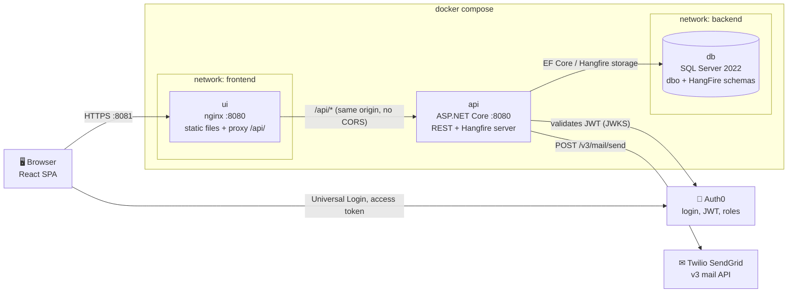
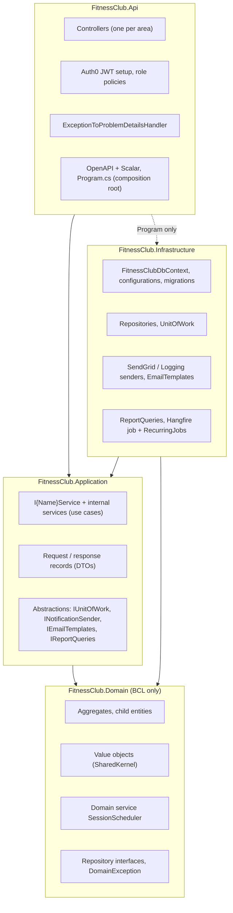
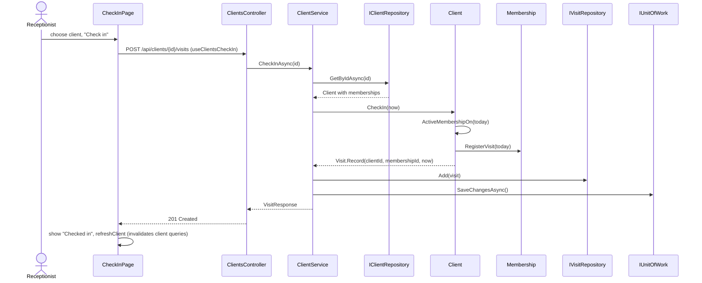
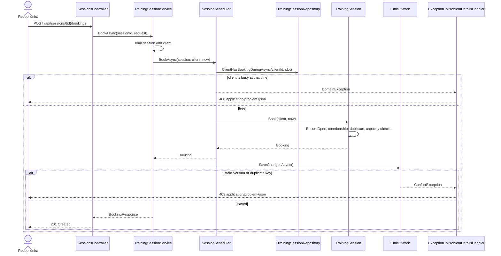
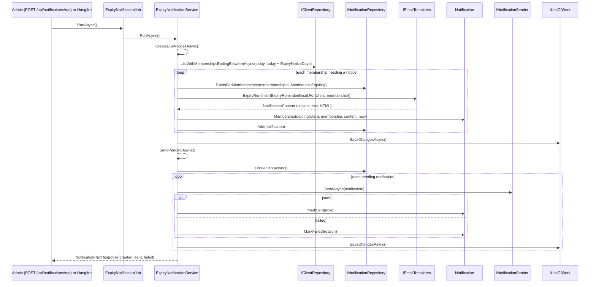

# Architecture

How the system is put together and how a request moves through it. The static structure is in [[Class Diagram]], the patterns in [[Design Patterns]], and the use cases in [[Use Cases]]. Original designs: [[2026-10-05-api-foundation-design]], [[2026-10-05-domain-model-and-architecture-design]], [[2026-10-07-ui-design]].

## Architectural styles

- **Client–server SPA + REST API.** The React UI talks to the API over HTTP only and never touches the database. Resources are nouns (`/api/clients/{id}/memberships`), state changes that aren't plain updates are sub-resources (`/activate`, `/cancel`, `/retry`), and status codes carry meaning: 201 + `Location` on create, 204 on no-content actions, 400/404/409 as `application/problem+json`.
- **Clean Architecture.** Four projects with dependencies pointing inwards. `FitnessClub.ArchitectureTests` (NetArchTest + Roslyn) fails the build if a layer references one it shouldn't.
- **Domain-Driven Design.** Aggregates guard their own rules, value objects validate themselves, and a domain service (`SessionScheduler`) handles the rules that span aggregates.
- **CQRS-lite read side.** Writes go through aggregates and repositories. Reports skip the aggregates and read the database directly through `IReportQueries` / `ReportQueries`.
- **Contract-first UI client.** A Debug build of the API writes the OpenAPI document `ui/openapi/fitnessclub.json`. Orval generates the UI's types, axios calls and TanStack Query hooks from it.
- **Containers.** Each service is its own Docker image; `deploy/docker-compose.yml` runs the stack.

## Deployment

The API sits on both networks, so the database is reachable only from the API. On startup the API runs `Database.MigrateAsync()` (schema + seed data), then registers the recurring job.

## Layers

| Layer | May reference | Holds |
|---|---|---|
| Domain | BCL only | Business rules. No EF Core, no ASP.NET. |
| Application | Domain, DI abstractions | Use cases. Never EF Core or `IQueryable`. |
| Infrastructure | Application, Domain | EF Core, SQL Server, Hangfire, SendGrid. Classes are `internal`. |
| Api | Application; Infrastructure only in `Program`; Domain only to map `DomainException` | HTTP, auth, error mapping. |

The UI is organised the same way on a smaller scale: `features/*` (one folder per screen), `api/` (generated client + `http.ts`), `auth/` (`RequireRole`, `AccessTokenBridge`), `layout/`, `app/` (routes, query client, theme).

## Request flows

### Check in a client

If the client has no active membership or already checked in today, `Client.CheckIn` throws `DomainException`, and the API answers 400 problem details (see the next flow).

### Book a session, and how errors come back

### Expiry notification run

`POST /api/notifications/run` calls `IExpiryNotificationService.RunAsync` directly; the Hangfire job calls the same method. The job is registered in `RecurringJobs.Register` with `Cron.Never()`, so today it runs only when triggered by hand (see [[Requirements Coverage]]).

## Cross-cutting concerns

- **Auth:** Auth0 JWT bearer. A fallback policy requires a signed-in user on every endpoint; controllers add `[Authorize(Roles = ...)]` with the `Roles` constants. The UI gets the token through `AccessTokenBridge` and attaches it in the axios request interceptor.
- **Errors:** one `IExceptionHandler` maps `DomainException` → 400, `NotFoundException` → 404, `ConflictException` → 409, anything else → 500. The UI shows `problemMessage(error)` from a `MutationCache.onError` handler.
- **Concurrency:** every aggregate root has a shadow `Version` token, re-stamped on save. A stale save → `ConflictException` → 409.
- **Time:** services use the injected `TimeProvider` and pass `now` into domain methods.
- **Validation:** DataAnnotations on request records (shape, automatic 400), then entities and value objects (business rules, `DomainException`).
