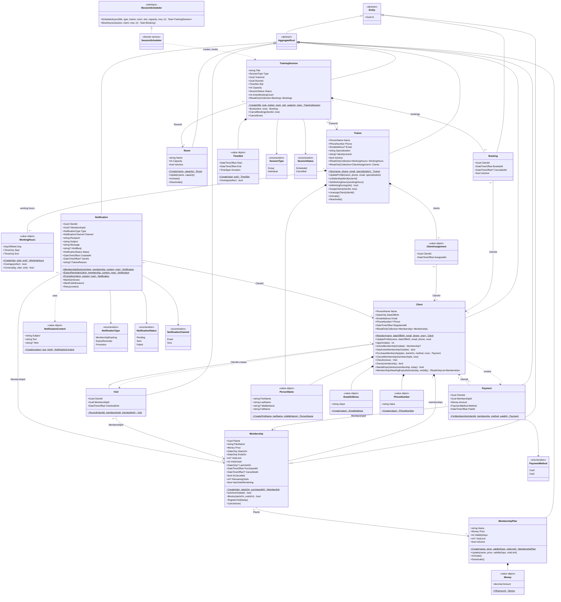
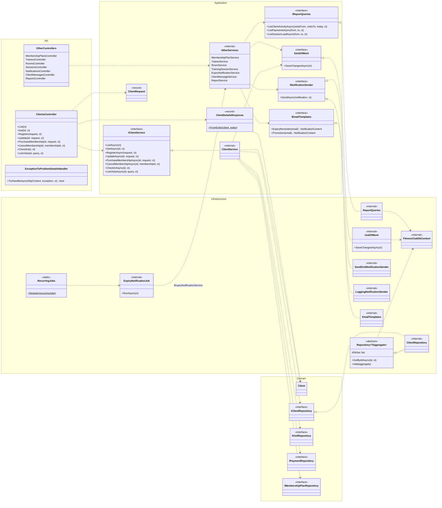

# Class Diagram

UML class diagrams drawn from the code in `api/src`. The first diagram is the domain model (`FitnessClub.Domain`). The second shows the whole system by layer, with one feature (Clients) in full. The design behind it is in [[2026-10-05-domain-model-and-architecture-design]], the patterns in [[Design Patterns]], and the runtime view in [[Architecture]].

Notation: `*--` composition (child lives inside the aggregate), `-->` association by id (aggregates never hold each other, only `Guid` ids), `..|>` realization, `..>` dependency, `<|--` inheritance. `$` marks a static member. Only key members are shown.

## 1. Domain model

Every aggregate root is `sealed`, has private setters and a private constructor, and is created only through a static factory method. Children (`Membership`, `Booking`, `WorkingHours`, `ClientAssignment`) are changed only through their root. Value objects in `SharedKernel` validate themselves on creation and throw `DomainException`.

`~` marks `internal` factory and mutator methods: only the owning aggregate (or `SessionScheduler` for `TrainingSession`) may call them. For example, a `Membership` is created only by `Client.PurchaseMembership`, and a `Booking` only by `SessionScheduler.BookAsync` → `TrainingSession.Book`.

### Repository interfaces (Domain)

Each aggregate root has one repository interface in Domain. Infrastructure implements them.

```mermaid
classDiagram
    class IRepository~TAggregate~ {
        <<interface>>
        +GetByIdAsync(id, ct) Task~TAggregate?~
        +Add(aggregate)
    }
    class IClientRepository {
        <<interface>>
        +ListAsync(ct)
        +EmailExistsAsync(email, excludeId, ct)
        +ListWithMembershipsEndingBetweenAsync(from, to, ct)
    }
    class IMembershipPlanRepository {
        <<interface>>
        +ListAsync(includeInactive, ct)
        +NameExistsAsync(name, excludeId, ct)
    }
    class ITrainerRepository {
        <<interface>>
        +ListAsync(includeInactive, ct)
        +PhoneExistsAsync(phone, excludeId, ct)
        +GetByIdentityUserIdAsync(identityUserId, ct)
    }
    class IRoomRepository {
        <<interface>>
        +ListAsync(includeInactive, ct)
        +NameExistsAsync(name, excludeId, ct)
    }
    class ITrainingSessionRepository {
        <<interface>>
        +TrainerHasSessionDuringAsync(trainerId, slot, ct)
        +RoomIsBookedDuringAsync(roomId, slot, ct)
        +ClientHasBookingDuringAsync(clientId, slot, ct)
        +ListStartingBetweenAsync(from, to, ct)
        +ListForTrainerStartingBetweenAsync(trainerId, from, to, ct)
    }
    class IVisitRepository {
        <<interface>>
        +ListForClientAsync(clientId, skip, take, ct)
        +CountForClientAsync(clientId, ct)
    }
    class IPaymentRepository {
        <<interface>>
        +ListPaidBetweenAsync(from, to, ct)
    }
    class INotificationRepository {
        <<interface>>
        +ExistsForMembershipAsync(membershipId, type, ct)
        +ListPendingAsync(ct)
        +ListForClientAsync(clientId, ct)
        +ListAsync(status, ct)
    }

    IRepository <|-- IClientRepository
    IRepository <|-- IMembershipPlanRepository
    IRepository <|-- ITrainerRepository
    IRepository <|-- IRoomRepository
    IRepository <|-- ITrainingSessionRepository
    IRepository <|-- IVisitRepository
    IRepository <|-- IPaymentRepository
    IRepository <|-- INotificationRepository
```

## 2. Whole system by layer

Dependencies point inwards: Api → Application → Domain, and Infrastructure implements the interfaces that Domain and Application declare. Clients is shown in full. The other areas have the same shape: `{Name}Controller` → `I{Name}Service` → `{Name}Service` → `I{Root}Repository`.

## Persistence mapping

`FitnessClubDbContext` maps each aggregate root to its own SQL Server table through an `IEntityTypeConfiguration` in `Infrastructure/Persistence/Configurations`. Children (`Membership`, `Booking`, `WorkingHours`, `ClientAssignment`) are owned types in their own tables (`Memberships`, `Bookings`, `TrainerWorkingHours`, `TrainerClients`), so they are saved and loaded with their root. `PersonName` and `TimeSlot` are owned types in the root's table. Single-value objects (`Money`, `EmailAddress`, `PhoneNumber`) are stored as one column through value conversions (`ValueConversions.cs`). Every root has a shadow `Version` concurrency token. The schema is created by the EF migrations `InitialCreate` and `SeedMockData`.
