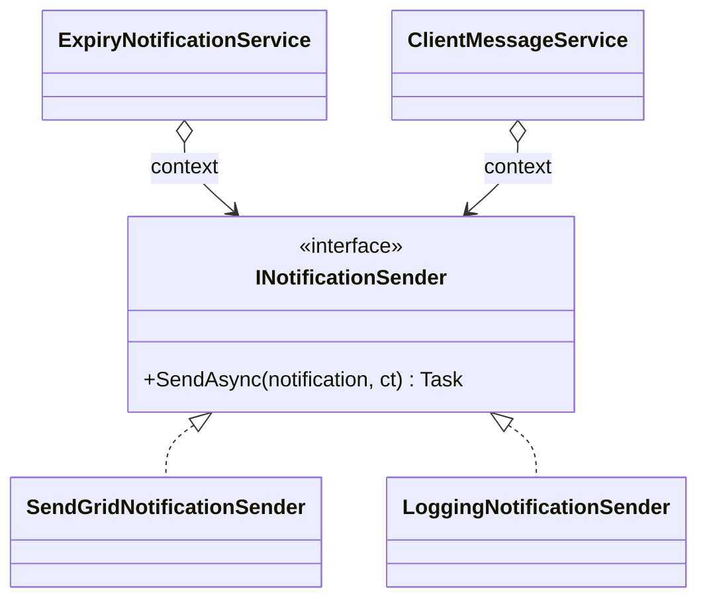
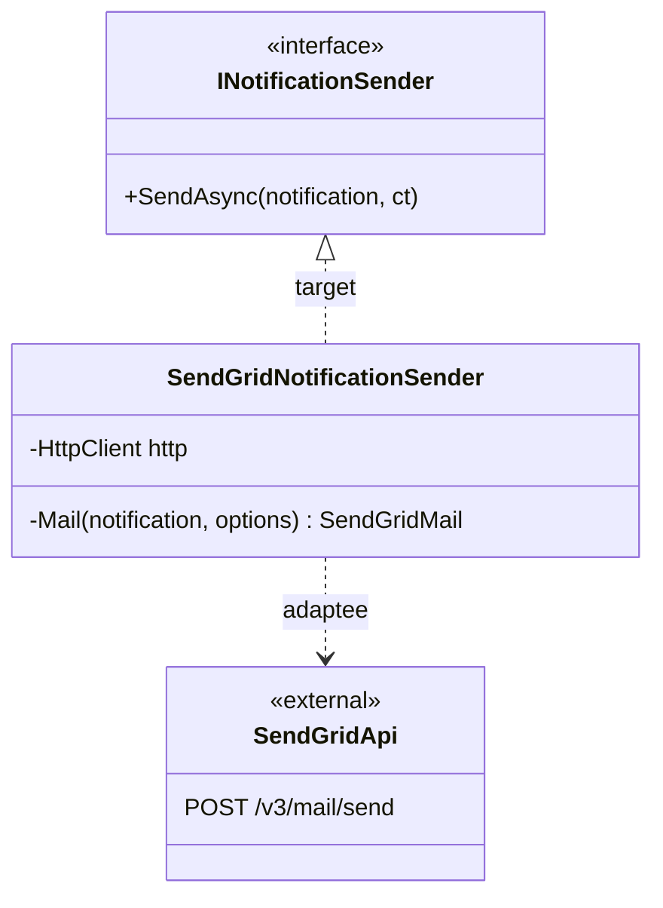
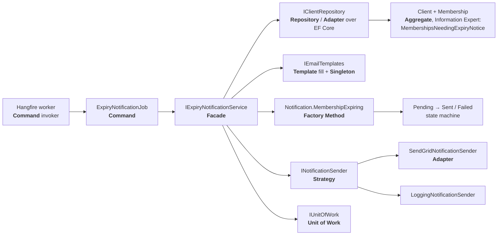

# Design Patterns

Which design patterns the system uses, where they are in the code, and how they work together. Everything here is already implemented; the class names are real. Structure: [[Class Diagram]]. Runtime view: [[Architecture]].

## How patterns were chosen

The requirements in [[Fitness Club System]] set the problems to solve:

| Problem from the requirements | Pattern that solves it |
|---|---|
| Clients must be notified about expiry; the delivery channel (email now, maybe SMS later) and the provider must be swappable, and tests must not send real email | **Strategy** (`INotificationSender`) + **Adapter** (`SendGridNotificationSender`) |
| Notifications must go out on a schedule, outside any HTTP request | **Command** (Hangfire job) |
| Clients, memberships, sessions have rules that must never be broken (no check-in without a membership, no double booking, capacity) | **Factory Method** on every aggregate + DDD Aggregate / Value Object |
| Controllers must stay thin and the UI must not know about storage | **Facade** (application services) + Repository / Unit of Work |
| Every error must come back to the UI in one shape | **Chain of Responsibility** (exception handler in the ASP.NET Core pipeline) |
| Screens must refresh after a change made elsewhere | **Observer** (TanStack Query cache) |
| Emails must look branded but stay safe | **Template Method**-style fill of fixed HTML templates |

## GoF patterns

### Strategy — behavioral

One interface, several interchangeable algorithms, chosen at runtime.

- `INotificationSender` (`api/src/FitnessClub.Application/Abstractions/INotificationSender.cs`) is the strategy. `SendGridNotificationSender` sends real email; `LoggingNotificationSender` only writes to the log.
- `AddInfrastructure()` (`api/src/FitnessClub.Infrastructure/DependencyInjection.cs`) picks one: SendGrid when `SendGrid:ApiKey` is set, otherwise logging. `ExpiryNotificationService` and `ClientMessageService` never know which one they got.
- The clock is a strategy too: services take .NET's `TimeProvider`; tests pass `FakeTimeProvider`.

### Adapter — structural

Wraps an incompatible interface so it fits the one the application expects.

- `SendGridNotificationSender` adapts the SendGrid v3 REST API (`POST v3/mail/send`, JSON `personalizations`/`content`) to `INotificationSender.SendAsync(Notification)`.
- Repositories (`ClientRepository`, `TrainingSessionRepository`, …) adapt EF Core's `DbSet<T>` and LINQ to the domain's `I{Root}Repository` interfaces, so Domain and Application never see EF Core.
- UI: `AccessTokenBridge` (`ui/src/auth/AccessTokenBridge.tsx`) adapts Auth0's `getAccessTokenSilently` hook to the plain `AccessTokenProvider` function that `ui/src/api/http.ts` expects.

### Facade — structural

One simple entry point in front of a subsystem.

- Each application service (`IClientService`, `ITrainingSessionService`, `IExpiryNotificationService`, …) is a facade for one area. A controller makes one call, e.g. `ClientService.CheckInAsync(id)`; behind it the service loads the aggregate from a repository, calls domain methods, adds new aggregates and calls `IUnitOfWork.SaveChangesAsync` once. Controllers inject only the facade (see the Clients diagram in [[Class Diagram]]).
- `AddApplication()` and `AddInfrastructure()` are facades over DI registration: `Program.cs` calls two methods instead of registering every service, repository and sender itself.

### Factory Method — creational (static factory variant)

Creation goes through a named method that checks the rules, never through a public constructor. Every aggregate and value object has a private constructor and a static factory:

- Aggregates: `Client.Register`, `Trainer.Hire`, `MembershipPlan.Create`, `Room.Create`, `Notification.MembershipExpiring` / `ExpiryReminder` / `Promotion`.
- Created by another aggregate (`internal`): `Membership.Create`, `Payment.ForMembership`, `Visit.Record` (called from `Client`), `TrainingSession.Create` (from `SessionScheduler`), `Booking.Create` (from `TrainingSession.Book`).
- Value objects: `Money.Of`, `TimeSlot.Create`, `PersonName.Create`, `EmailAddress.Create`, `PhoneNumber.Create`, `WorkingHours.Create`, `NotificationContent.Create`.

This is the static-factory form of the pattern (named constructors), not the subclass-override form from the GoF book. `Notification` shows why it matters: three factories build the same class for three situations, and each checks its own preconditions (`MembershipExpiring` requires `client.NeedsExpiryNotice(...)`, `ExpiryReminder` requires an active membership).

### Template Method — behavioral (template-fill variant)

A fixed skeleton with steps filled in later.

- `EmailTemplates` (`api/src/FitnessClub.Infrastructure/Notifications/EmailTemplates.cs`) loads fixed HTML skeletons (`ExpiryReminder.html`, `Promotion.html`, embedded resources) and `Fill` replaces each `{{Token}}` with an HTML-encoded value. The layout is fixed; only the variable parts change. A missing value throws, so a template can't go out half filled.
- `Repository<TAggregate>` is an abstract base that implements the shared steps (`GetByIdAsync`, `Add`) once; each `{Root}Repository` adds its own queries on top of the protected `Set`.

Neither uses the classic abstract-hook-method form, so the label is a variant.

### Command — behavioral

A request turned into an object that can be stored, queued and run later.

- Hangfire stores the call `ExpiryNotificationJob.RunAsync(CancellationToken.None)` as a serialized job in SQL Server (`RecurringJobs.Register`), and a Hangfire worker executes it later, outside any HTTP request. `[DisableConcurrentExecution]` makes sure two runs never overlap. The job is the command, Hangfire is the invoker, `IExpiryNotificationService` is the receiver.
- Request records (`PurchaseMembershipRequest`, `ScheduleSessionRequest`, `BookSessionRequest`) carry one use case's parameters as one object.

### Chain of Responsibility — behavioral

A request passes along a chain of handlers until one handles it.

- ASP.NET Core's middleware pipeline is the chain; `app.UseExceptionHandler()` puts an exception step in it, and `ExceptionToProblemDetailsHandler : IExceptionHandler` is one handler: `TryHandleAsync` returns `true` when it has written the response. It maps `DomainException` → 400, `NotFoundException` → 404, `ConflictException` → 409, else 500.
- UI: axios interceptors in `ui/src/api/http.ts` form request and response chains: the request interceptor adds the bearer token, the response interceptor rejects an HTML page sent instead of JSON.

### Observer — behavioral

Subscribers are notified when shared state changes.

- TanStack Query: each component that calls a generated hook (`useClientsList`, `useClientsGet`, …) subscribes to that query in the `QueryClient` cache. After a mutation the code invalidates keys (`refreshClient`, `invalidateSessions`), and every subscribed screen re-renders with fresh data.
- `MutationCache.onError` in `ui/src/app/queryClient.ts` observes every mutation and shows one error notification.

### Decorator — structural (tests)

Wraps an object to add behavior without changing its interface.

- `CountingUnitOfWork(IUnitOfWork inner)` in `api/tests/FitnessClub.IntegrationTests/Services` counts calls and then delegates to the real `UnitOfWork`. Service tests use it to check that a use case saves exactly once.

### Singleton — creational (container-managed)

One shared instance for the whole app. Not the static-`Instance` form: the DI container owns the lifetime.

- `services.AddSingleton<IEmailTemplates, EmailTemplates>()` (templates are loaded once into static fields) and the `ExpiryNotificationOptions` instance.
- UI: one `QueryClient` from `createQueryClient()` for the app.

## Other patterns (not GoF)

| Pattern | Source | Where |
|---|---|---|
| Repository | Fowler, DDD | `IRepository<T>` and `I{Root}Repository` in Domain; `Repository<T>` and `{Root}Repository` in Infrastructure |
| Unit of Work | Fowler | `IUnitOfWork` (Application) → `UnitOfWork` (Infrastructure); one `SaveChangesAsync` per use case; turns SQL errors 2601/2627 and stale saves into `ConflictException` |
| Layer Supertype | Fowler | `Entity` (Id), `AggregateRoot`, `Repository<T>` |
| Aggregate, Entity, Value Object | DDD | Aggregates `Client`, `TrainingSession`, `Trainer`, …; value objects in `Domain/SharedKernel` |
| Domain Service | DDD | `SessionScheduler`: trainer/room/client conflicts need a repository, so they don't fit in one aggregate |
| Data Transfer Object | Fowler | Request/response records with `FromEntity` mappers, e.g. `ClientDetailsResponse.FromEntity` |
| Optimistic Offline Lock | Fowler | Shadow `Version` token on every aggregate root (`FitnessClubDbContext`) |
| State machine (enum-based) | — | `Notification`: Pending → Sent / Failed, Failed → Pending through `Retry`; `TrainingSession`: Scheduled → Cancelled. Guarded by methods (`EnsurePending`, `EnsureOpen`). Not the GoF State pattern: there are no state classes. |
| Dependency Injection, Composition Root | — | Constructor injection everywhere; wiring only in `Program.cs`, `AddApplication()`, `AddInfrastructure()` |
| Separated read model (CQRS-lite) | — | Reports read through `IReportQueries` / `ReportQueries`, not through aggregates |
| Route guard | — | `RequireRole` in `ui/src/auth/RequireRole.tsx` |

## How the patterns work together

### Expiry notification run (backend)

One run of the expiry job uses almost every backend pattern, each with one job to do:

1. Hangfire (or `POST /api/notifications/run`) invokes the stored **Command** `ExpiryNotificationJob.RunAsync`.
2. The job calls one **Facade** method, `IExpiryNotificationService.RunAsync`.
3. The facade asks the **Repository** for clients whose memberships end soon. EF Core stays behind the **Adapter**.
4. The `Client` **Aggregate** decides which memberships need a notice (`MembershipsNeedingExpiryNotice`): it holds the data, so it holds the rule.
5. `EmailTemplates` (**Template** fill, one **Singleton** instance) builds the subject, text and branded HTML.
6. `Notification.MembershipExpiring` (**Factory Method**) creates a valid, Pending notification, and the **Unit of Work** saves all of them in one go.
7. For each pending notification the facade calls the **Strategy** `INotificationSender`; the SendGrid **Adapter** sends it, or the logging strategy logs it. The notification's **state machine** moves to Sent or Failed, and failed ones can be retried.
8. When the run is started over HTTP and something goes wrong, the **Chain of Responsibility** exception handler turns it into problem details.

Swapping SendGrid for another provider, or adding SMS, changes one class and one DI line; nothing in steps 1–6 changes.

### A staff action in the UI (frontend → backend)

The receptionist clicks "Check in". The generated hook (contract-first client) sends the request; the axios request interceptor (**Chain of Responsibility**) adds the token it gets through `AccessTokenBridge` (**Adapter**). On the server the controller calls the `IClientService` **Facade**, which loads the `Client` **Aggregate** via its **Repository**, calls `Client.CheckIn` (which creates the `Visit` through its **Factory Method**), and saves through the **Unit of Work**. Back in the UI, `refreshClient` invalidates the client's queries, and every subscribed screen updates (**Observer**). A broken rule comes back as 400 problem details and the `MutationCache` observer shows it.

## GRASP

| Principle | Where |
|---|---|
| **Information Expert** | The class that has the data owns the rule: `Client.CheckIn`, `Client.NeedsExpiryNotice`, `Membership.IsActiveOn`, `Trainer.IsWorkingDuring`, `TimeSlot.Overlaps`, `WorkingHours.Covers`, `TrainingSession.Book` (capacity). |
| **Creator** | Whoever contains or records an object creates it: `Client` creates `Membership`, `Payment` and `Visit`; `TrainingSession` creates `Booking`; `Trainer` creates `ClientAssignment`. |
| **Controller** | API controllers receive system events; each use case is handled by one application service method (a use-case controller), e.g. `TrainingSessionService.BookAsync`. |
| **Low Coupling** | Layers talk through interfaces; aggregates reference each other only by `Guid` id; the UI knows the API only through the generated client. |
| **High Cohesion** | One service per area (`ClientService`, `RoomService`, …), one folder per feature in Domain, Application and `ui/src/features`. |
| **Polymorphism** | `INotificationSender` implementations replace `if (hasApiKey)` branches in the services. |
| **Pure Fabrication** | Classes that aren't domain concepts but keep the domain clean: `UnitOfWork`, repositories, `ReportQueries`, `EmailTemplates`, `SessionScheduler`, `ExceptionToProblemDetailsHandler`. |
| **Indirection** | `IUnitOfWork`, `IRepository<T>` and `IReportQueries` sit between the use cases and EF Core. |
| **Protected Variations** | Points expected to change are behind interfaces: email provider (`INotificationSender`), templates (`IEmailTemplates`), time (`TimeProvider`), report SQL (`IReportQueries`), API contract (OpenAPI + generated client). |

## SOLID

- **Single Responsibility.** Controllers only map HTTP to one service call (`ClientsController`). Services orchestrate a use case. Aggregates hold rules. `UnitOfWork` only saves and translates database errors. `EmailTemplates` only builds email content; senders only deliver it.
- **Open/Closed.** A new delivery channel is a new `INotificationSender` class plus one DI line; `ExpiryNotificationService` doesn't change. A new feature area is added beside the others (aggregate, repository, service, controller) without editing existing ones.
- **Liskov Substitution.** `SendGridNotificationSender` and `LoggingNotificationSender` are interchangeable: both take any `Notification` and either finish or throw, and the services treat a throw as a failed delivery. `FakeTimeProvider` replaces `TimeProvider` in tests, and `CountingUnitOfWork` replaces `UnitOfWork`.
- **Interface Segregation.** Small interfaces: `IUnitOfWork` has one method, `INotificationSender` one, `IRepository<T>` two. Each aggregate gets its own repository interface with only the queries it needs. Reports have their own `IReportQueries` instead of growing the repositories.
- **Dependency Inversion.** Domain declares the repository interfaces and Application declares `IUnitOfWork`, `INotificationSender`, `IEmailTemplates` and `IReportQueries`; Infrastructure implements them. High-level code never references EF Core, Hangfire or SendGrid, and `FitnessClub.ArchitectureTests` fails the build if it does.
