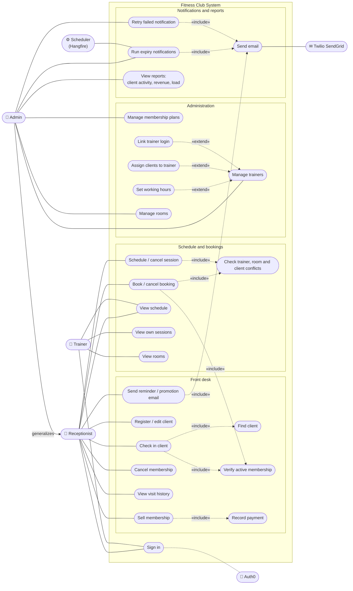

# Use Cases

Use case diagram of the fitness club system as it is built. Requirements are in [[Fitness Club System]], endpoints per requirement in [[Requirements Coverage]], and the classes behind each use case in [[Class Diagram]].

## Actors

| Actor | Kind | Who it is |
|---|---|---|
| Receptionist | primary | Front desk staff. Role `Receptionist` in `Roles.cs`. |
| Admin | primary | Club manager. Role `Admin`. Can do everything a receptionist can, plus settings, notifications and reports. |
| Trainer | primary | Role `Trainer`. Sees the schedule and rooms, read-only, and their own sessions. |
| Scheduler | secondary | The Hangfire job `membership-expiry-notifications` (`ExpiryNotificationJob`). |
| Auth0 | secondary | Identity provider. Signs users in and puts their roles into the access token. |
| Twilio SendGrid | secondary | Email delivery for expiry notices, reminders and promotions. |

## Diagram

Mermaid has no native use case diagram, so this is a flowchart in UML style: actors outside the system boundary, use cases as rounded nodes, dashed `«include»` / `«extend»` edges. Admin generalizes Receptionist, so Admin has every receptionist use case too.

## Use case → endpoint → screen

All endpoints need a signed-in user (Auth0 JWT). Role checks are `[Authorize(Roles = ...)]` on the controllers, and the UI hides screens with `RequireRole` and `navItems` in `ui/src/layout/navigation.ts`.

| Use case | Actors | Endpoints | UI screen |
|---|---|---|---|
| Sign in | All staff, Auth0 | Auth0 Universal Login; every API call carries the access token | Login redirect |
| Check in client | Receptionist, Admin | `POST /api/clients/{id}/visits` | `/check-in` |
| Register / edit client | Receptionist, Admin | `GET/POST /api/clients`, `GET/PUT /api/clients/{id}` | `/clients`, `/clients/:clientId` |
| Sell membership (+ record payment) | Receptionist, Admin | `POST /api/clients/{id}/memberships` | Client page → Memberships |
| Cancel membership | Receptionist, Admin | `POST /api/clients/{id}/memberships/{membershipId}/cancel` | Client page → Memberships |
| View visit history | Receptionist, Admin | `GET /api/clients/{id}/visits?page&pageSize` | Client page → Visits |
| Send reminder / promotion email | Receptionist, Admin, SendGrid | `GET /api/clients/{id}/messages/preview`, `POST/GET /api/clients/{id}/messages` | Client page → Messages |
| Schedule / cancel session | Receptionist, Admin | `POST /api/sessions`, `POST /api/sessions/{id}/cancel` | `/schedule` |
| Book / cancel booking | Receptionist, Admin | `POST /api/sessions/{id}/bookings`, `POST /api/sessions/{id}/bookings/{clientId}/cancel` | `/schedule` → session drawer |
| View schedule | Receptionist, Admin, Trainer | `GET /api/sessions?from&to`, `GET /api/sessions/{id}` | `/schedule` |
| View own sessions | Trainer | `GET /api/sessions/mine` | `/schedule` (My schedule) |
| View rooms | Trainer (read), Receptionist, Admin | `GET /api/rooms`, `GET /api/rooms/{id}` | `/rooms` |
| Manage membership plans | Admin | `POST /api/membership-plans`, `PUT /{id}`, `/activate`, `/deactivate` | `/plans` |
| Manage trainers (+ hours, clients, login) | Admin | `POST /api/trainers`, `PUT /{id}`, `/activate`, `/deactivate`, `PUT /{id}/working-hours`, `POST/DELETE /{id}/clients/{clientId}`, `PUT /{id}/identity` | `/trainers`, `/trainers/:trainerId` |
| Manage rooms | Admin | `POST /api/rooms`, `PUT /{id}`, `/activate`, `/deactivate` | `/rooms` |
| Run expiry notifications | Admin, Scheduler, SendGrid | `POST /api/notifications/run`; Hangfire job `membership-expiry-notifications` (registered with `Cron.Never()`, so it runs only by hand) | `/notifications` |
| Retry failed notification | Admin | `POST /api/notifications/{id}/retry` | `/notifications` |
| View reports | Admin | `GET /api/reports/client-activity`, `/revenue`, `/load` | `/reports` |
